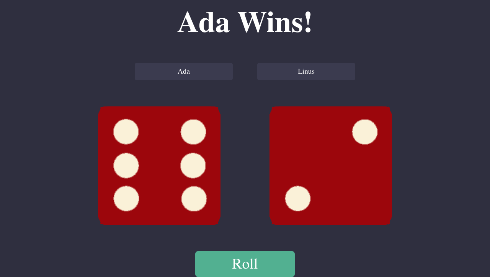

# Dice Roller Game

## Overview
This is a simple 3D Dice Roller game built with React. Players can roll two dice and see who gets the higher number. Players can also customize their names.

## Demo

**[Open the live game](https://3d-dice-game.pages.dev/)**



*Current production build at 1280 px with synthetic player names and deterministic browser values. The capture uses the operating system's reduced-motion preference: one real final roll produces Ada 6, Linus 2, and the same announced winner without repeated intermediate spins.*

[Open the historical interaction recording](screen-recording.gif) to see the original assignment flow. It is kept as provenance rather than embedded autoplaying motion.

## Features
- Roll two dice and display results.
- Customizable player names.
- Animation for rolling the dice.
- Responsive design.
- Screen-reader announcements for rolling state, final outcomes, and both dice values.
- Reduced-motion support: the game skips repeated intermediate rolls and 3D transitions while preserving one real final roll and the same outcome rules.

## Technologies Used
- React
- CSS
- JavaScript

## Assignment Info
This project is created as part of Week 9 assignments for Patika Frontend Bootcamp.

## Verification

The game rules are isolated from animation timing so CI can deterministically verify the complete 1–6 face range, both customized-player win paths, and draws:

```sh
npm ci
npm test
npm run lint
npm run build
```
