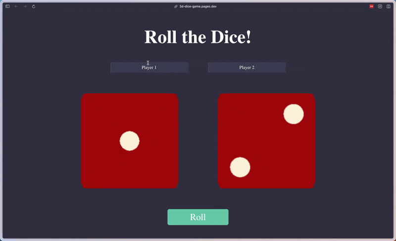

# Dice Roller Game

## Overview
This is a simple 3D Dice Roller game built with React. Players can roll two dice and see who gets the higher number. Players can also customize their names.

## Demo

Check out the [live version:](https://3d-dice-game.pages.dev/)


## Features
- Roll two dice and display results.
- Customizable player names.
- Animation for rolling the dice.
- Responsive design.
- Screen-reader announcements for rolling state, final outcomes, and both dice values.

## Technologies Used
- React
- CSS
- JavaScript

## Assignment Info
This project is created as part of Week 9 assignments for Patika Frontend Bootcamp.

## Verification

The game rules are isolated from animation timing so CI can deterministically verify the complete 1–6 face range, both customized-player win paths, and draws:

```sh
npm ci
npm test
npm run lint
npm run build
```
